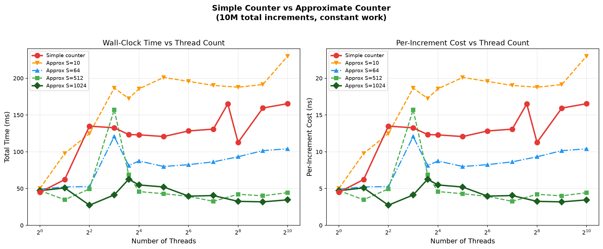
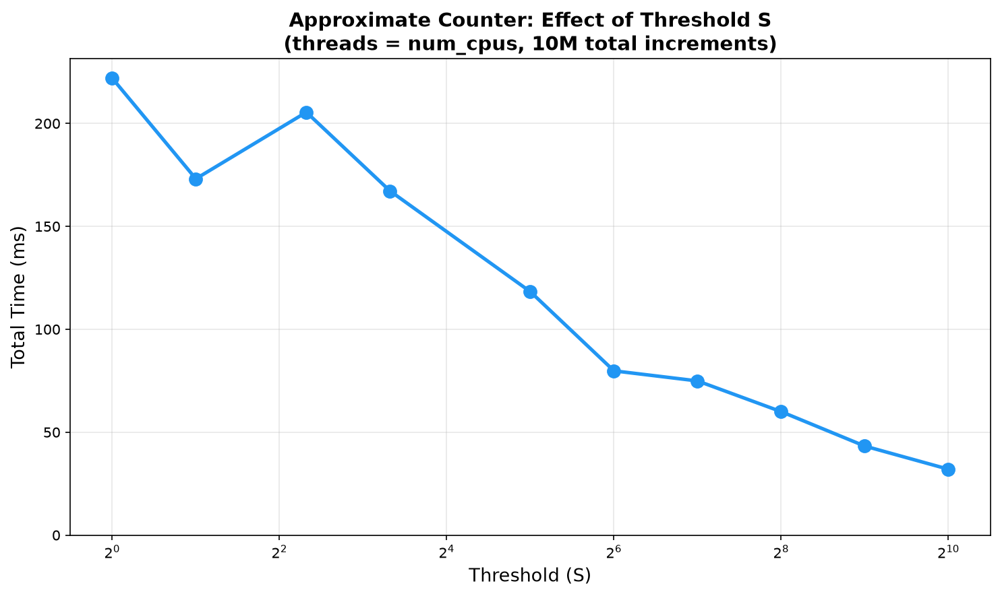

# The Fix Was Faster Than Single-Threaded. But First, I Made It 4x Worse.

*How a textbook data structure hid a performance trap, and what fixing it taught me about CPU caches.*

---

In [Part 1](/link-to-part-1), I benchmarked a simple concurrent counter — one lock, one integer, all threads fighting over it. The conclusion was clear: adding threads to a single-lock counter makes things 3-4x slower. The lock serializes everything. More threads just means more waiting.

The OSTEP textbook (Chapter 29) introduces the simple counter specifically because it's terrible. It's the setup for a cleverer design: the **approximate counter**, also called the **sloppy counter**. The promise is real parallelism — threads that can actually do work simultaneously instead of waiting in line.

I built it, benchmarked it, and the first thing that happened was that it performed *worse* than the simple counter. Significantly worse. Here's the story.

---

## How the Approximate Counter Works

The idea is simple: instead of one global counter protected by one lock, give each CPU its own **local counter** with its own lock.

```
Simple counter:          Approximate counter:
                         
  [global: 42]             [global: 30]
  [  lock  ]               [  glock  ]
       |                        |
  all threads             CPU 0    CPU 1    CPU 2    ...
  fight here             [local:4] [local:3] [local:5]
                         [llock]   [llock]   [llock]
```

When a thread increments, it grabs its own CPU's local lock (no contention — other threads are on different CPUs) and bumps the local counter. Periodically, when a local counter reaches a threshold **S**, it drains into the global counter:

```c
void approx_update(counter_t *c, int threadID, int amt) {
    int cpu = threadID % c->num_cpus;
    lock(&c->llock[cpu]);
    c->local[cpu] += amt;
    if (c->local[cpu] >= S) {       // threshold reached
        lock(&c->glock);            // rare: grab global lock
        c->global += c->local[cpu];
        unlock(&c->glock);
        c->local[cpu] = 0;
    }
    unlock(&c->llock[cpu]);
}
```

With S=1024, the global lock is touched only once every 1,024 increments. With 12 threads doing 10M total increments, that's fewer than 10,000 global lock acquisitions — almost nothing. The rest of the time, each thread works independently on its own local counter.

The tradeoff: the global counter is always slightly behind. At any moment, it can be off by up to `S * num_cpus`. With S=1024 and 12 CPUs, the global value could be off by up to 12,288. Hence "approximate."

---

## First Run: Somehow Worse Than the Simple Counter

I coded it up following the OSTEP design and ran the benchmark. 12 threads, S=1024 (maximum locality, minimal global lock usage). I expected it to be dramatically faster than the simple counter's ~130ms.

It took **575ms**. Over 4x slower.

I checked the code three times. The logic was correct. The correctness check passed — all 10 million increments were accounted for. But the performance was backwards. Larger thresholds made it *slower*, not faster. Something else was going on.

---

## The Bug: False Sharing

The OSTEP textbook defines the approximate counter struct like this:

```c
int local[NUMCPUS];          // per-CPU counters
pthread_mutex_t llock[NUMCPUS]; // per-CPU locks
```

This looks fine. Each CPU has its own slot. Thread 0 writes to `local[0]`, thread 1 writes to `local[1]`, and so on. No two threads touch the same variable. No contention. Right?

Wrong. Here's the problem.

CPUs don't read and write individual `int` values from memory. They operate on **cache lines** — 64-byte chunks. When your code writes to `local[0]`, the CPU loads the entire 64-byte chunk containing `local[0]` into its cache. But `local[0]` is only 4 bytes. That means `local[1]`, `local[2]`, ..., `local[15]` are all sitting in the **same 64-byte cache line**.

```
One 64-byte cache line:
[ local[0] | local[1] | local[2] | ... | local[15] ]
     4B         4B         4B              4B

Thread 0 writes here ----^
Thread 1 writes here ---------------^
Both trigger the SAME cache line to bounce between cores!
```

When thread 0 on core 0 writes to `local[0]`, the hardware says: "Core 0 now has the only valid copy of this cache line. Invalidate everyone else's copy." When thread 1 on core 1 writes to `local[1]` a nanosecond later, the hardware says: "Now core 1 needs exclusive access. Invalidate core 0's copy. Transfer the line."

This is called **false sharing**. The variables are logically independent (each thread has its own slot), but physically they share a cache line, so the hardware treats every write as a conflict. With 12 threads, 12 cores are playing tug-of-war with the same cache line on every single increment. That's the *exact problem* the approximate counter was supposed to solve — and the naive memory layout brings it right back.

The fix: pad each local counter to fill an entire cache line:

```c
#define CACHE_LINE 64

typedef struct {
    int value;
    char _pad[CACHE_LINE - sizeof(int)]; // fill the rest of the 64 bytes
} __attribute__((aligned(CACHE_LINE))) padded_int_t;

padded_int_t local[NUMCPUS]; // now each local[i] is on its own cache line
```

60 bytes of padding per counter. Pure waste from a memory perspective. But it means `local[0]` and `local[1]` are now on different cache lines, so core 0 and core 1 can write simultaneously without invalidating each other.

---

## After the Fix: The Numbers OSTEP Promised

With cache line padding, here's the comparison:



Now the approximate counter does what it's supposed to. The key numbers at 12 threads (my CPU count):

| Configuration | Time (ms) | vs Simple counter |
|---|---|---|
| Simple counter | 155 | baseline |
| Approx S=10 | 173 | ~same (S too small, global lock still hot) |
| Approx S=64 | 81 | 1.9x faster |
| Approx S=512 | 55 | 2.8x faster |
| Approx S=1024 | 35 | **4.4x faster** |

With S=1024, the approximate counter at 12 threads is faster than the simple counter with *1 thread* (35ms vs 45ms). That's genuine parallelism — the work is actually being done in parallel across cores, not serialized through a bottleneck.

And look at what happens with even more threads: the approximate counter with S=512 or S=1024 stays essentially **flat** from 4 threads to 1024 threads, hovering around 30-50ms. The simple counter can never do that — it's stuck at ~155ms regardless of thread count because the single lock serializes everything.

---

## The Threshold Tradeoff

The second plot sweeps through different threshold values with the thread count fixed at 12 (my CPU count):



This is a clean downward curve. Going from S=1 to S=1024:

| Threshold S | Time (ms) | What's happening |
|---|---|---|
| 1 | 222 | Every increment hits global lock. Worse than simple counter (extra local lock overhead). |
| 10 | 167 | Global lock touched every 10 increments. Still too frequent. |
| 64 | 80 | Global lock touched ~1,300 times total. Contention drops sharply. |
| 256 | 60 | Sweet spot: ~3,255 global acquisitions. Mostly parallel. |
| 1024 | 32 | Global lock touched ~813 times. Almost pure parallel execution. |

**S=1 is the worst case** — it's functionally equivalent to the simple counter (every increment transfers to global) but with extra overhead from also grabbing the local lock. You're paying for two locks instead of one and getting no parallelism benefit.

**S=1024 is the best performance** — but the global counter can be off by up to 12,288 at any moment. Whether that matters depends on your use case. For analytics or approximate monitoring, it's fine. For a bank balance, it's not.

---

## What False Sharing Actually Costs

To put the false sharing impact in perspective:

| | Without padding | With padding |
|---|---|---|
| S=1024, 12 threads | 575 ms | 35 ms |
| S=1024, 1 thread | 73 ms | 48 ms |

**16.4x** difference for the multi-threaded case. The single-threaded case also improves (no false sharing with one thread, but the padded struct has better alignment).

This is one of those bugs that's invisible in the source code. The logic is correct. The output is correct. The performance is just mysteriously terrible. You'd never find it by reading the code — you'd find it by either knowing about cache lines beforehand or by profiling and seeing inexplicable cache misses.

The OSTEP textbook doesn't mention false sharing in its approximate counter implementation. The code in the book uses `int local[NUMCPUS]` — which has this exact problem. It's a good lesson: textbook pseudocode is about teaching the algorithm, not about production performance. The gap between "correct" and "fast" can be 16x.

---

## The Takeaway

1. **The approximate counter works.** With proper cache line padding and a reasonable threshold, it delivers genuine parallel scaling. S=1024 with 12 threads is 4.4x faster than the simple counter and faster than even single-threaded execution.

2. **False sharing is a silent killer.** Logically independent data that shares a cache line behaves as if it's contended. The fix is trivial (padding), but finding the problem is hard if you don't know to look for it.

3. **The tradeoff is real.** Higher threshold S means better performance but less accurate global count. There's no free lunch — you're trading precision for parallelism. The threshold sweep plot shows the exact curve of that tradeoff.

4. **This is why systems programming is hard.** The same algorithm, implemented two ways that look nearly identical in source code, can differ by 16x in performance. The difference isn't in the logic — it's in how the data maps to hardware.

---

## Setup & Reproducibility

All code is in the same project as Part 1:
- `approx_counter_benchmark.c` — the benchmark (with cache line padding)
- `plot_approx_results.py` — comparison and threshold sweep plots
- `run_benchmarks.sh` — compile and run everything in one command

```bash
./run_benchmarks.sh
```

---

*This is Part 2 of a series on concurrent data structures from OSTEP Chapter 29. [Part 1](/link-to-part-1) covered the simple counter, NUMA topology, and thread placement effects.*
